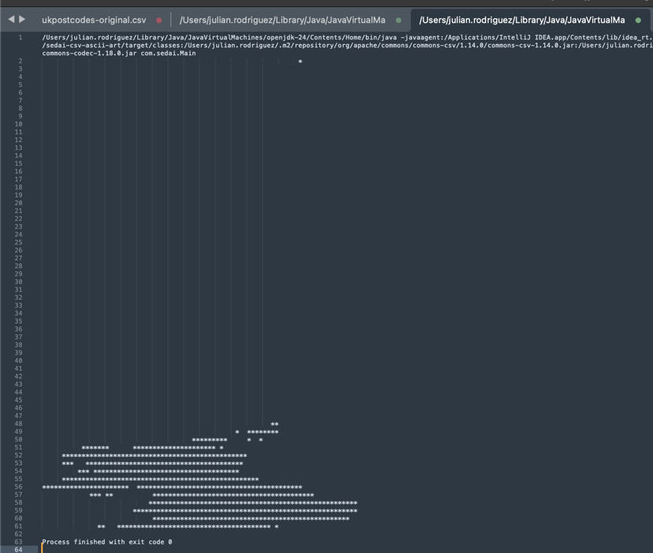
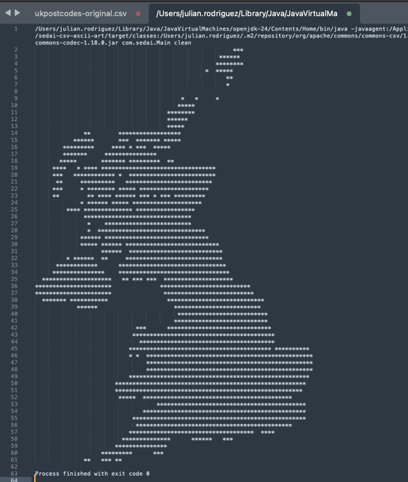

# Sedai CSV ASCII art generator
## This project takes inputs from a CSV file containing tuples of latitude and longitude that match the postal zip codes for the UK

## Table of Contents
- [Installation & Setup](#installation--setup)
- [Usage](#usage)
- [Results](#results)
- [License](#license)


## 🛠️ Installation & Setup

1. **Clone the Repository**
   ```bash
   git clone https://github.com/your-org/sedai-csv-ascii-art.git
   cd sedai-csv-ascii-art
   ```

2. **Build and Package**

   Use Maven to package the application:
   ```bash
   mvn clean package
   ```

   This will generate a `.jar` file in the `target/` directory.

3. **Download and Run the Application**

   If you're providing a prebuilt `.jar` file, share it as a downloadable asset. Users can download it and run it like this:

   ```bash
   java -jar sedai-csv-ascii-art-1.0.jar
   ```

   Or if built locally:
   ```bash
   java -jar target/sedai-csv-ascii-art-1.0.jar
   ```

4. **Dependencies**

   Make sure to include the following in your `pom.xml`:
    - Lombok
    - Apache Commons Lang

   See the full dependency list in the `README` above.

##  Usage

The application can be used with two types of CSV files:

1. **Original CSV File**: This file contains tuples of latitude and longitude corresponding to UK postal zip codes. It may include some entries with placeholder coordinates (latitude `99.999999000000000` and longitude `0.000000000000000`), which are not valid and may distort the ASCII art output.

2. **Cleaned CSV File**: For optimal results, use a cleaned version of the file where entries with invalid latitude and longitude values (as mentioned above) are removed. These invalid entries cause the rendered ASCII map to become distorted and shift out of the true geographical boundaries of the UK.

We recommend preprocessing the original file to filter out these problematic entries before running the application.

To run the application with the `clean` version of the csv, you should specify the word `clean`
as program argument.

##  Results

Application output with original ukpostcodes.csv file:


Application output with original ukpostcodes-clean.csv file:



